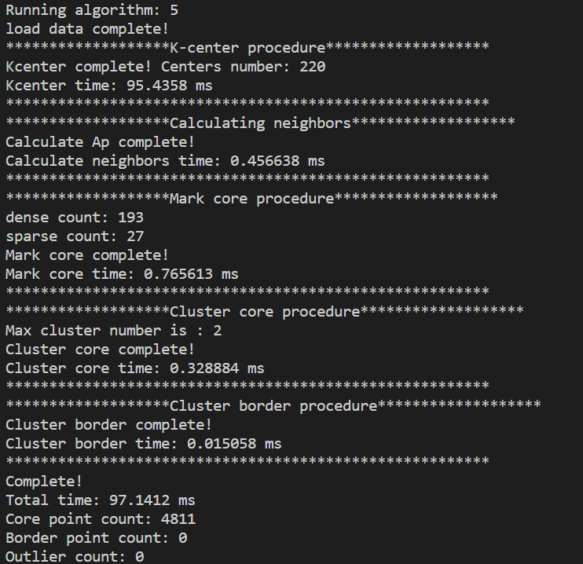

# Towards Metric DBSCAN: Exact, Approximate, and Streaming Algorithms

This repository is the official implementation of **Towards Metric DBSCAN: Exact, Approximate, and
Streaming Algorithms**.

The Faster Exact Metric DBSCAN Algorithms, and the Metric $\rho$-approximate DBSCAN Via Core Points Summary Algorithms are implemented by c++.

The Streaming $\rho$-approximate DBSCAN Algorithm( Our streaming algorithm ) is implemented by python.

## Requirements
***

You can directly run our algorithms implemented by c++ on Linux platform.

To install requirements of our Our streaming algorithm:

```{Shell}
pip install -r requirements.txt
```
## Main Organization of the Code

***

* **datasets:** this folder contains the clustering datasets we used in the paper. For our streaming algorithm, please use datasets that have a suffix '.csv', and for our other algorithms, please use datasets that do not have suffix.

* **linux:** this folder contains executable files implemented by c++ for the Linux environment. 

* **result:** this folder is used to store the output of the algorithms and is empty by default.
* **src:** this folder contains the C++ code of our algorithms. Besides, folder src/StreamingAlg contains the python code of our streaming algorithms.
* **src:** this folder contains the C++ headers of our algorithms.

## Compile and Run

***

### Our exact and approximate algorithms

**run** file Linux/Algorithms in the following way:

```{Shell}
./linux/Algorithms --alg {algorithm number} --dim {dimension of dataset} --n {number of data points} --minpts {parameter MinPts} --epsilon {parameter epsilon} --rho {approximate ratio rho} --input {dataset file path} --output_data {result output path} --output_center {output path of E}
```

The 'algorithm number' argument can be:

* **1:** vanilla exact DBSCAN 
* **2:** our exact DBSCAN via Radius-Guided Gonzalez
* **3:** our exact DBSCAN via Cover Tree
* **4:** our exact DBSCAN via Radius-Guided Gonzalez for edit distance
* **5:** our approximate DBSCAN via Radius-Guided Gonzalez
* **6:** our approximate DBSCAN via Randomized Gonzalez
* **7:** our approximate DBSCAN via Radius-Guided Gonzalez for edit distance
* **8:** our approximate DBSCAN via Cover Tree
* **9:** vanilla exact DBSCAN for edit distance


Their are some optional arguments should be used if you run the algorithm 3, 6 or 8:

For Randomized gonzalez-based algorithm:

* **--init_num {initial center number}** 
* **--farthest_num {number of farthest points chosen in every loop}** 
* **--select_num {number of farthest points added to E in every loop}** 

For covertree-based algorithms:
* **--max_layer {max possible covertree layer}** 
* **--terminate_layer {terminate layer when searching NN}** 
  
For example, you can run our approximate method via Radius-Guided Gonzalez by the following command:

```{Shell}
./linux/Algorithms --alg 5 --dim 2 --n 4811 --minpts 4 --epsilon 0.05 --rho 0.5 --input ./datasets/banana --output_data ./result/output_result.txt --output_center ./result/output_center.txt
```

**compile**

If necessary, we can recompile the executable files in the following way:

```{Shell}
g++ -O3 -std=c++11 -o ./linux/Algorithms ./src/*.cpp
```


### Our streaming algorithm

Our streaming algorithm is implemented by python.

Before running the program, please ensure that the following libraries are installed in your Python environment.

* PyTorch 2 (cuda is not necessary)
* numpy
* tqdm

To run the example program, please follow these steps:
1. Change the current directory to `src/StreamingAlg`.
2. Enter the command `make moons` to run the program with the `Moons` dataset.
3. The `ARI` and `AMI` indices will be displayed on the screen.
4. If your environment does not support the `make` command, you can open the `Makefile` file with a text editor and manually enter the commands from there into the command line, for example, if you want to run Our streaming algorithm on `Moons` dataset, you need to enter:
    ```{shell}
    moons:
	python ./DBSCAN.py \
		--data=../../datasets/moons_data.csv \
		--buffer_size=100 \
		--rho=0.5 \
		--eps=2 \
		--minpts=10 \
		--label_out=./output/moons_label.csv
	python ./Analysis.py \
		--y=../../datasets/moons_label.csv \
		--label=./output/moons_label.csv
    ```


This folder contains five files: 
1. `main.py`: our main code for streaming approximate DBSCAN.
1. `DBSCAN.py`: Another version for streaming approximate DBSCAN.
2. `Analysis.py`: calculate ARI and AMI.
3. `PlotCenter.py`: plot the center of balls.
4. `PlotCore.py`: plot the core points.
5. `PlotLabel.py`: plot the label of points.

## Results

***

### Algorithm 1~9

When the user runs Algorithm 1~9, the program will output the following format to the output file specified by the user: 

Each number indicating the clustering result (cluster ID) of one data point.

In addition, the program will output some statistical results to the screen.

For example, if the user enters the following command:

```{Shell}
./linux/Algorithms --alg 5 --dim 2 --n 4811 --minpts 4 --epsilon 0.05 --rho 0.5 --input ./datasets/banana --output_data ./result/output_result.txt --output_center ./result/output_center.txt
```
then the content in  ./result/output_result.txt will become:


and the following content will be output to the screen:




### Our streaming algorithm

First, we need to change the current directory to `src/Algorithm4`.

Then we can run Our streaming algorithm by entering the following command:
```
make moons
```
Then the following result will be displayed in screen.

```
data size =  (9948, 2)
Data load completed.
The first pass: 100%|██████████████████████████████| 78/78 [00:01<00:00, 68.75it/s]
The second pass: 100%|████████████████████████████| 78/78 [00:00<00:00, 110.55it/s]
The third pass: 100%|█████████████████████████████| 78/78 [00:00<00:00, 833.19it/s]
Merge inside S_*: 100%|████████████████████████| 220/220 [00:00<00:00, 7112.44it/s]
|E|= 407
|M| =  1193
|S_*| =  220
Number of clusters  3
the total memory usage / n =  0.16083634901487737
clustering completed with 2.1617186069488525 s
ARI =  0.9675238354642742
AMI =  0.9337253148748574
```
Besides, the program will store the label of all points on src/Algorithm4/output/moons_label.csv

If you want to change data set, please enter the corresponding command in this table.

|   Dataset  |  ARI |  AMI |      Command      |
|:----------:|:----:|:----:|:-----------------:|
|    Moons   | 0.94 | 0.90 |     make moons    |
|    Cancer  | 0.94 | 0.92 |     make cancer   |
| Arrhythmia | 0.57 | 0.73 |   make arrhythmia |
|   Biodeg   | 0.22 | 0.15 |    make biodeg    |
|   MNIST   | 0.70 | 0.52 | make mnist |
|  Fashion MNIST   | 0.47 | 0.71 |    make fashion_mnist    |
|    USPS HW   | 0.57 | 0.53 |     make uspshw    |